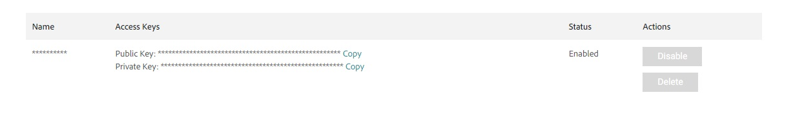

# Configuring Magento store

This guide explains the step needed to install and set up Magento 2 store for Vue Storefront.

## Prerequisites

Before you can get started, you need the following:

- **Docker Desktop** to setup Magento 2 locally,
- **Magento Marketplace account** to download Magento 2. To create it, visit [this page](https://account.magento.com/customer/account/create/).

## Creating the Magento 2 store

We're going to install Magento 2 inside the `server` folder. Run the following commands to create a `server` folder first:

```sh
mkdir server
cd server
```

### Getting access keys for Magento

Registry that stores Magento and other third-party packages requires authentication. You'll need to generate access keys in the Magento Marketplace to install them.

Follow the [Get your authentication keys](https://devdocs.magento.com/guides/v2.4/install-gde/prereq/connect-auth.html) guide to generate new access keys.



### Setting up the Magento 2 store

To simplify the setup, let's use the [`markshust/docker-magento`](https://github.com/markshust/docker-magento) script.

Run the command below to create the store. It will ask you for the Username and Password. Use your public access key as a username and your private access key as a password from the previous step.

```sh
curl -s https://raw.githubusercontent.com/markshust/docker-magento/master/lib/onelinesetup | bash -s -- magento.test 2.4.4
```

### Setting up the authentication

In the Magento 2 folder, copy the `src/auth.json.sample` file and rename it to `src/auth.json`. You can do it manually or use the following command:

```sh
cp src/auth.json.sample src/auth.json
```

Update the username and password values with your Magento public and private keys.

```json
{
    "http-basic": {
        "repo.magento.com": {
            "username": "a1c69cb…",
            "password": "af041560…"
        }
    }
}
```

Finally, copy the file to the container by running the following command:

```sh
bin/copytocontainer auth.json
```

### Populating with sample data

In the Magento 2 folder, execute the commands below to add sample data to your store.

```sh
bin/magento sampledata:deploy
```

Then update the configuration:

```sh
bin/magento setup:upgrade
```

### Enabling CORS

You may need to enable CORS origins in your Magento store to accept requests from other domains, e.g., `magento.dev`. In the Magento 2 folder, add the package `graycore/magento2-cors` by running the command below:

```sh
bin/composer require graycore/magento2-cors
```

Then, add the following configuration at the end of `src/app/etc/env.php`:

```php
    'system' => [
        'default' => [
            'web' => [
                'graphql' => [
                    'cors_max_age' => 86400,
                    'cors_allow_credentials' => 0,
                    'cors_allowed_methods' => 'POST, OPTIONS, GET',
                    'cors_allowed_headers' => 'Content-Currency, Store, X-Magento-Cache-Id, X-Captcha, Content-Type, Authorization, DNT, TE',
                    'cors_allowed_origins' => '*'
                ]
            ]
        ]
    ]
```

Enable the graycore cors.

```sh
bin/magento module:enable Graycore_Cors
```

Then update the configuration:

```sh
bin/magento setup:upgrade
```
