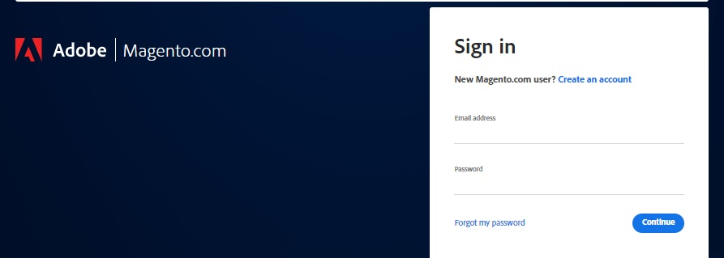
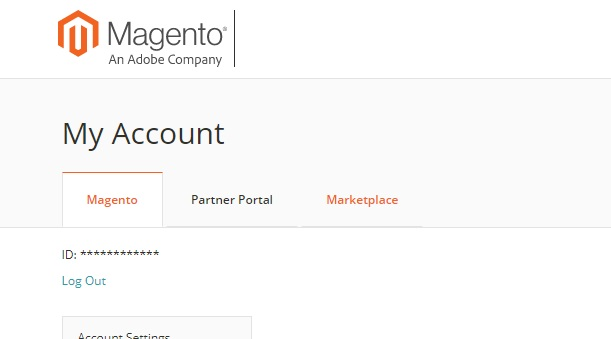
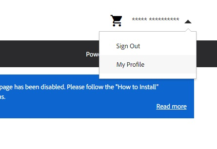
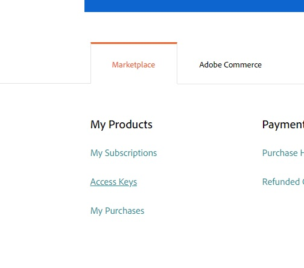
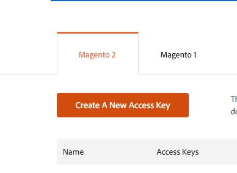
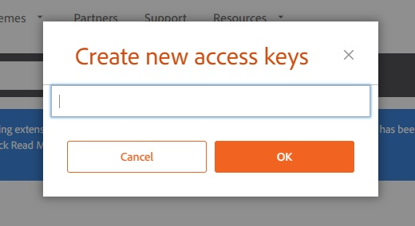

# Creating a Store

In this guide we explain step-by-step how you can create a store with Vue Storefront 2 and Magento 2.

> ℹ️ We're gonna use `my-store` as the project name and the folder structure below as its initial structure for this guide.
>
> ```
> ./
> ├─ my-store/
> │  ├─ client/
> │  │  ├─ …
> │  ├─ server/
> │  │  ├─ …
> ```
>
> So be sure to create the `my-store` folder..
>
> ```sh
> mkdir my-store
> cd my-store
> ```

## Requirements

- NodeJS version 16+
- Docker Desktop
  - It's only required to setup Magento 2 locally
- Magento Marketplace account
  - You can use your account of create a new one in [here](https://account.magento.com/customer/account/create/)

## Creating the Magento 2 store

We're going to create the Magento 2 store inside `server` folder to let explicit that we're just using it as backend layer for our store.

```sh
mkdir server
cd server
```

### Getting access keys for Magento

Magento and other third-party packages used by Composer are stored in a repository that requires authentication. So in order to install Magento we'll need to generate access keys in the Magento Marketplace. **That's why the Magento Marketplace account is a requirement.**

[Sign in](https://account.magento.com/customer/account/login) into Magento Marketplace, open your profile in the Marketplace and create a new access key on "Access Keys" page.


> ℹ️ In Magento's Dev Docs you can get more information about authentication keys.
>
> <https://devdocs.magento.com/guides/v2.4/install-gde/prereq/connect-auth.html>

<details>
  <summary>🧵 Here's a step-by-step version of how to create access keys</summary>

1. [Sign in](https://account.magento.com/customer/account/login) into Magento Marketplace;

   

2. In your Magento Account page, click in the "Marketplace" tab;

   

3. In your user's menu, click in the "My Profile" item;

   

4. Click in the "Access Keys" link;

   

5. Click in the "Create a new access key" button;

   

6. Type in a name for these access keys and click in the "OK" button;

   

</details>

### Setting up the Magento 2 store

To reduce the complexity we're will use the one-line setup command of [`markshust/docker-magento`](https://github.com/markshust/docker-magento). So you just have to run the command below to create the store. After running it will ask for the Username and Password, use your public access key as username and your private access key as password.

```sh
curl -s https://raw.githubusercontent.com/markshust/docker-magento/master/lib/onelinesetup | bash -s -- magento.test 2.4.4
```

Here's a recording of these steps:

<Asciinema id="493276" />

## Creating the Vue Storefront for Magento 2

That's the easy part, you just need to execute the `init` command of Vue Storefront CLI in the project root folder. It will ask you for the project name and the integration. Keep in mind that the project name will also be used as the project folder name, and be sure to select the Magento 2 integration.

```sh
npx @vue-storefront/cli init
```

Here's a recording of these steps:

<Asciinema id="493286" />

## How to start if you want to contribute?

Want to contribute? Ping us on `magento2-vsf2` channel on [our Discord](https://discord.vuestorefront.io)!
