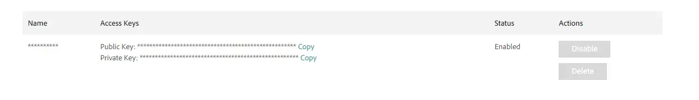

# Installation

Welcome to the Vue Storefront Magento 2 Integration installation guide! This guide will help you install Vue Storefront on your local machine.

- **[Installation using CLI](#installation-using-cli)** - install Vue Storefront and Magento 2 instance locally using CLI (recommended)
- **[Manual Installation](#manual-installation)** - install Vue Storefront and connect to an existing Magento 2, or manually install Vue Storefront and Magento 2 instance locally.

## Prerequisites

Before you start, make sure you have the following tools installed:

- [Node.js](https://nodejs.org/en/) - Vue Storefront requires Node.js version 16.
- [Yarn](https://classic.yarnpkg.com/en/docs/install) - Vue Storefront requires Yarn package manager to install dependencies and run scripts.
- [Docker](https://docs.docker.com/get-docker/) - only if you want to install Magento 2 instance locally using CLI. We recommend using [Docker Desktop](https://www.docker.com/products/docker-desktop/).
- [Magento Marketplace account](https://account.magento.com/customer/account/create/) - to get API credentials for your Magento instance.

If you already have Node.js installed, make sure it's **version 16**. You can check the version by running the following command:

```bash
node -v
```

In case you have other version of Node.js installed, you can use [nvm](https://github.com/nvm-sh/nvm) to install and manage multiple versions of Node.js.

## Installation using CLI

::: tip
This is a beta version of the CLI. If you encounter any issues, please report them on **[GitHub](https://github.com/vuestorefront/vue-storefront/issues/new/choose)**. Thanks for helping us make the CLI better!
:::

If you prefer a video guide - here's a quick start guide to get your project up and running.

<iframe width="560" height="315" src="https://www.youtube-nocookie.com/embed/WZUJ3P0hee4" title="YouTube video player" frameborder="0" allow="accelerometer; autoplay; clipboard-write; encrypted-media; gyroscope; picture-in-picture" allowfullscreen></iframe>


## Installation steps

**Installation using CLI** is a quick and easy way to get your project up and running. It will install Vue Storefront and Magento 2 instance locally using Docker. It will also generate sample data for your store *(optional)*.

**CLI** will guide you through the installation process and ask you to provide the required information.

::: tip
CLI may take up to 10 minutes to complete the installation process. Please be patient.
:::

### Step 1: Run CLI to create a new project


```bash
npx @vue-storefront/cli init
```

### Step 2: Enter project name

When prompted, enter the name of your project. It will be used as a directory name for your project.

```bash
┌ Welcome to Vue Storefront 2 CLI! 💚
|
◆  🚀  What's your project name?
|  my-project
```

::: warning
Avoid using special characters and spaces in the project name.
:::

### Step 2: Select Magento 2 integration

When prompted, select Magento 2 integration:

```bash
◆ ⚙️  Choose an integration template:
| >  Magento 2
|    Shopify
|    Vendure
|    Spree
|    Custom Integration
```

### Step 3: Install Magento 2 instance locally

When prompted, select the option to install Magento 2 instance locally using CLI:

```bash
◆ 🤓 Do you want to install Magento 2 locally on your computer? (BETA)
| > Yes / No
```

::: tip
If you already have Magento 2 instance installed, you can skip this step and connect Vue Storefront to your existing Magento 2 instance. See [Manual Installation](#manual-installation) for more details.
:::

### Step 4: Provide Magento 2 API credentials

When prompted, provide your Magento 2 API credentials:

```bash
◆ 🔐 Please provide your Magento access keys
|
◆ 🔑 Magento access key:
| <YOUR_MAGENTO_ACCESS_KEY>
◆ 🔒 Magento secret key
| <YOUR_MAGENTO_SECRET_KEY>
```

To get Magento 2 API credentials - [Adobe Merchant Center - Magento 2 Access Keys](https://marketplace.magento.com/customer/accessKeys/)

### Step 5: Provide Magento 2 instance URL

When prompted, provide the URL of your Magento 2 instance:

```bash
◆ 🌐 Magento domain name
| <YOUR_MAGENTO_DOMAIN_NAME>
```

The Magento 2 instance URL will be used to connect Vue Storefront to your Magento 2 instance - by default, the URL of the local Magento instance is `magento.test` 

CLI will start installing Magento 2 instance locally using Docker. It will take a few minutes.

::: tip
You will be asked to provide system administrator password to allow Docker to run commands on your machine.
:::

### Step 6: Generate sample data (optional)

When prompted, select the option to generate sample data:

```bash
◆ 🛒 Do you want to generate sample data for the store?
| > Yes / No
```

### Step 7: Start the project

Once CLI finishes the installation process, you will have a completely configured and ready to use Vue Storefront project. You can start the application using the commands below:

Go to the newly created directory and start the project in development mode:

```bash
cd my-project

yarn dev
```

### Congratulations! 🎉

You have successfully installed Vue Storefront and Magento 2 instance locally using CLI. You can now start developing your store 🚀

Continue the documentation to learn how to build your store using Vue Storefront. 

For more advanced configuration options, check out the [Vue Storefront Advanced Configuration](./advanced-configuration.html) page.


## Manual Installation

This guide explains the steps needed to install Vue Storefront and Magento 2 manually.

It will also guide you through the process of connecting Vue Storefront to your Magento 2 instance.

### Step 1: Run CLI to create a new project


```bash
npx @vue-storefront/cli init
```

### Step 2: Enter project name

When prompted, enter the name of your project. It will be used as a directory name for your project.

```bash
┌ Welcome to Vue Storefront 2 CLI! 💚
|
◆  🚀  What's your project name?
|  my-project
```

::: warning
Avoid using special characters and spaces in the project name.
:::

### Step 2: Select Magento 2 integration

When prompted, select Magento 2 integration:

```bash
◆ ⚙️  Choose an integration template:
| >  Magento 2
|    Shopify
|    Vendure
|    Spree
|    Custom Integration
```

### Step 3: Install Magento 2 instance locally

When prompted, select `No` to skip the installation of Magento 2 instance locally:

```bash
◆ 🤓 Do you want to install Magento 2 locally on your computer? (BETA)
| Yes / > No
```

### Step 4: Vue Storefront project generated

CLI will generate a new Vue Storefront project. After the process is complete, install the dependencies:

```bash
cd my-project

yarn install
```

### Step 5: Install Magento 2 instance

We're going to install Magento 2 inside the `server` folder. Get back to the above directory and run the following commands to create a `server` folder first:

```sh
mkdir server
cd server
```

### Step 6: Install Magento 2 instance

To simplify the setup, let's use the [`markshust/docker-magento`](https://github.com/markshust/docker-magento) script.

Run the command below to create the store. It will ask you for the Username and Password. Use your public access key as a username and your private access key as a password from the previous step.

```sh
curl -s https://raw.githubusercontent.com/markshust/docker-magento/master/lib/onelinesetup | bash -s -- magento.test
```

Wait for the installation to finish. It will take a few minutes.

### 7. Get Magento Marketplace access keys

Registry that stores Magento and other third-party packages require authentication. You'll need to generate access keys in the Magento Marketplace to install them.

Follow the [Get your authentication keys](https://devdocs.magento.com/guides/v2.4/install-gde/prereq/connect-auth.html) guide to generate new access keys.



### 8. Setup authentication

In the Magento 2 folder, copy the `src/auth.json.sample` file and rename it to `src/auth.json`. You can do it manually or use the following command:

```sh
cp src/auth.json.sample src/auth.json
```

Update the username and password values with your Magento public and private keys.

```json
{
    "http-basic": {
        "repo.magento.com": {
            "username": "a1c69cb…",
            "password": "af041560…"
        }
    }
}
```

Finally, copy the file to the container by running the following command:

```sh
bin/copytocontainer auth.json
```

### 9. Increase default GraphQL query complexity

For security reasons, Magento 2, by default, allows maximum GraphQL query complexity of 300 and depth of 20. You need to change these values using the [GraphQL CustomConfig module](https://github.com/caravelx/module-graphql-config), which allows configuring these values in the admin panel.

To install the Magento 2 GraphQL Config module, run the following commands on your Magento installation:

```bash
bin/composer require caravelx/module-graphql-config
bin/magento module:enable Caravel_GraphQlConfig
bin/magento setup:upgrade
bin/magento setup:di:compile
bin/magento setup:static-content:deploy -f
```

Then go to the admin panel, find the configuration panel of the `GraphQL CustomConfig` module, and set:

- **complexity** to 1500,
- **depth** to 20.

For more information, see the [GraphQL security configuration](https://devdocs.magento.com/guides/v2.4/graphql/security-configuration.html) page.

### 10. Populate store with sample data (optional)

In the Magento 2 folder, execute the commands below to add sample data to your store.

```sh
bin/magento sampledata:deploy
```

Then update the configuration:

```sh
bin/magento setup:upgrade
```

### 11. Configure Vue Storefront environment variables

After installation, the first step is configuring the integration using the environment variables.

1. Go to the root folder of your project.
2. Make a copy of the `.env.example` file and rename it to `.env`. You can do it manually or use the following command:

```sh
cp .env.example .env
```

3. Update values in the `.env` file.

4. Explanation of env variables: 

#### Nuxt application configuration options
```
VSF_NUXT_APP_ENV=development  # application mode [production|development]
VSF_NUXT_APP_PORT=3000        # nuxt server port property
VSF_NUXT_APP_HOST=0.0.0.0     # nuxt server host property
```

#### Storefront and middleware endpoints configuration
```
VSF_STORE_URL=http://localhost:3000           # external base url
API_BASE_URL=http://localhost:3000/api/       # external middleware base url
API_SSR_BASE_URL=http://localhost:3000/api/   # internal middleware base url
```

If you have configured **HTTPS** on your local machine, you need to change the `VSF_STORE_URL`, `API_BASE_URL`, and `API_SSR_BASE_URL` to `https://localhost:3000/api/`.

:::tip middleware_url and ssr_middleware_url

For many infrastructures `middleware_url` and `ssr_middleware_url` will be the same, but sometimes they might be different.

For example, when it comes to deployment using a rolling-update strategy on the Kubernetes cluster, the Kubernetes is probing SSR if it's already up. SSR is trying to call middleware using an external URL (market...storefrontcloud.io) rather than localhost:3000/API, while the middleware isn't available publicly yet, because the SSR didn't respond with 200 in the first place.
:::


#### Magento 2 endpoints configuration and others
```
VSF_MAGENTO_BASE_URL=https://{YOUR_SITE_FRONT_URL}                # Magento 2 base url - magento.test is the default value
VSF_MAGENTO_GRAPHQL_URL=https://{YOUR_SITE_FRONT_URL}/graphql     # Magento 2 GraphQL endpoint

VSF_MAGENTO_EXTERNAL_CHECKOUT_ENABLED=false
VSF_MAGENTO_EXTERNAL_CHECKOUT_URL=https://{YOUR_SITE_FRONT_URL}   # Magento 2 external checkout url
VSF_MAGENTO_EXTERNAL_CHECKOUT_SYNC_PATH=/vue/cart/sync
```

#### Image provider configuration
```
NUXT_IMAGE_PROVIDER=ipx                                                               # image provider [ipx|cloudinary]
NUXT_IMAGE_PROVIDER_BASE_URL=https://res-4.cloudinary.com/{YOUR_ID}/image/upload/     # base url for cloudinary
NUXT_IMAGE_PROVIDER_DOMAIN=https://res-4.cloudinary.com                               # domain for cloudinary
```

#### Redis cache configuration
```
VSF_REDIS_ENABLED=false                               # toggle redis cache
VSF_REDIS_HOST=127.0.0.1                              # redis host
VSF_REDIS_PORT=6379                                   # redis port
VSF_REDIS_KEY_PREFIX=                                 # redis key prefix
VSF_REDIS_CACHE_INVALIDATE_URL=/cache-invalidate      # redis cache invalidate url
```
#### ReCaptcha configuration
```
VSF_RECAPTCHA_ENABLED=false           # toggle ReCaptcha
VSF_RECAPTCHA_SITE_KEY=               # ReCaptcha site key
VSF_RECAPTCHA_SECRET_KEY=             # ReCaptcha secret key
VSF_RECAPTCHA_HIDE_BADGE=             # ReCaptcha hide badge
VSF_RECAPTCHA_SIZE=invisible          # ReCaptcha size
VSF_RECAPTCHA_MIN_SCORE=0.5           # ReCaptcha min score
VSF_RECAPTCHA_VERSION=3               # ReCaptcha version
```

#### Cookies configuration
```
VSF_COOKIE_HTTP_ONLY=              # toggle http only cookies
VSF_COOKIE_SECURE=                 # toggle secure cookies
VSF_COOKIE_SAME_SITE=              # toggle same site cookies
VSF_COOKIE_PATH=                   # cookie path
```

#### Other
```
NODE_TLS_REJECT_UNAUTHORIZED=0      # toggle TLS verification (eg. for a local development)
```

### Congratulations! 🎉

You have successfully installed Vue Storefront and Magento 2 instance locally using CLI. You can now start developing your store 🚀

Continue the documentation to learn how to build your store using Vue Storefront. 

For more advanced configuration options, check out the [Vue Storefront Advanced Configuration](./advanced-configuration.html) page.


## F.A.Q. 

### I already have a Magento 2 instance, how can I connect it to Vue Storefront?

If you already have a Magento 2 instance, you can connect it to Vue Storefront by following the steps below:

- Follow the [Manual Installation](#manual-installation) guide and generate Vue Storefront project.
- Skip steps 5-7, since you already have a Magento 2 instance.
- Continue with step 8 and configure the environment variables.

### How to run Vue Storefront in production mode?

To run Vue Storefront in production mode, you need to set the `VSF_NUXT_APP_ENV` variable to `production` in the `.env` file.

### How to setup https for local development?

To setup https for local development, please check [Using HTTPS configuration for a local development](./advanced-configuration.html#using-https-configuration-for-a-local-development).

### Where can I get Magento 2 Access Keys?

Follow the [Get your authentication keys](https://devdocs.magento.com/guides/v2.4/install-gde/prereq/connect-auth.html) guide to generate new access keys.

### I'm trying to install dependencies with npm install and I'm getting an error

Please make sure you are using **yarn** to install dependencies. If you are using npm, please remove the `package-lock.json` file and run `yarn install` instead.

### I'm not sure what Node version am I using

You can check your Node version by running `node -v` in your terminal. In case you have other version of Node.js installed, you can use [nvm](https://github.com/nvm-sh/nvm) to install and manage multiple versions of Node.js.

### How can I contribute to Vue Storefront?

If you want to contribute to Vue Storefront, please go to our GitHub and read [Contributing guide](https://github.com/vuestorefront/vue-storefront/blob/main/CONTRIBUTING.md). 

You can always check the existing [GitHub Issues](https://github.com/vuestorefront/vue-storefront/issues) or create a new one.

### CLI doesn't work on my machine, it gives me an error

If you are using Windows, please make sure you are using the latest version of Node.js. If you are using Linux, please make sure you have the latest version of `npm` installed.

Check that Docker is running and you have enough memory allocated to it.

In case nothing helps, please create a new issue on our GitHub and we will try to help you or contact us on [Discord](https://discord.vuestorefront.io).

## Recommended tools

Below are the tools we use to make the development and debugging easier, and we recommend you use them too.

### Vue.js Devtools

We strongly recommend installing [Vue.js Devtools](https://devtools.vuejs.org/guide/installation.html) in your browser. It's an excellent tool for viewing component structures and their current state, inspecting events, routes, and much more.

### Vetur for VS Code

For those using Visual Studio Code as their primary code editor, we also recommend using [Vetur extension](https://marketplace.visualstudio.com/items?itemName=octref.vetur).
It speeds up the development of Vue.js-based applications by providing features like Vue.js code autocompletion and syntax highlighting.
