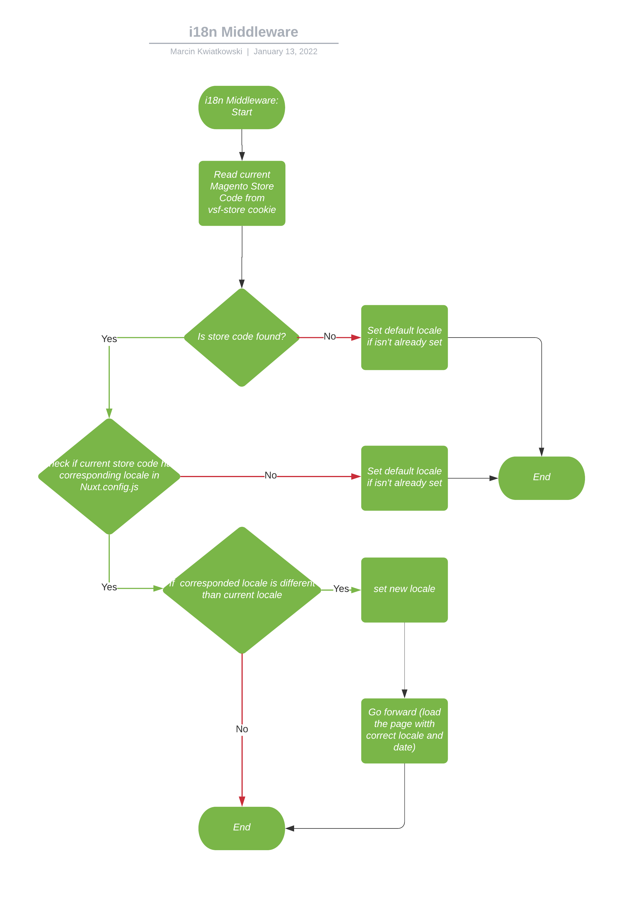

# Middlewares

Here you can find documentation for global Middlewares

## i18n

i18n middleware is responsible for handling store changes after URL changes.

It checks if locale in i18n module is changes and update `vsf-store` and `vsf-locale` cookie to match new store on both
client and server side.

### Flow
1. Start: load middleware
2. Read current Magento Store Code from vsf-store cookie
3. Is store code found?
   2. No: Set default locale if isn't already set
      1. End
4. Yes: Check if current store code has corresponding locale in Nuxt.config.js
   1. No: Set default locale if isn't already set
      1. End
5. Yes: If  corresponded locale is different than current locale
   1. No: End
6. Yes: set new locale
7. Go forward (load  the page with correct locale and date)
8. End

