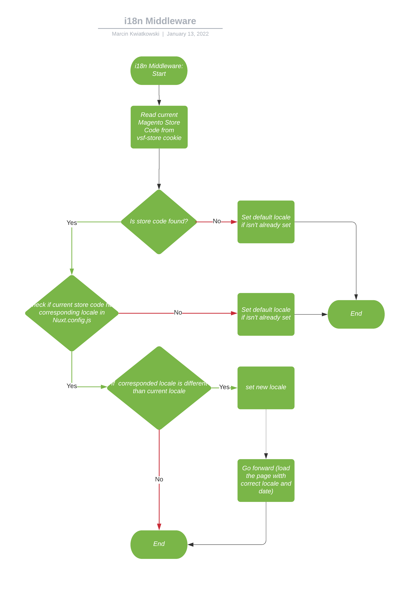

# Plugins

Here you can find documentation for global Middlewares

## i18n

i18n plugin is responsible for handling store changes after URL changes.

It checks if locale in i18n module is changes and update `vsf-store` and `vsf-locale` cookie to match new store on both
client and server side.

### Flow



## Currency

We expose `$fc` (format currency) function as a plugin to allow you to convert any number or string into a formatted currency string. Under the hood plugins uses Intl.NumberFormat class to handle formatting and therefore exposes the same options configuration.
Here are few examples of how you can use it in templates.

```javascript
$fc(productGetters.getPrice(product).regular); // by default vsf-currency cookie is used to define target currency
$fc(productGetters.getPrice(product).regular, { currency: 'USD' }); // you can easily override this behaviour by passing configuration object
```

Configuration object is an interface Intl.NumberFormatOptions, check it for all available options.

---

**_NOTE_**

Why we are not using built-in i18n package currency configuration and $n function to cover currency displaying?

The answer is because we must be able to handle multiple currencies within one store but in i18n package, currency and locale are in 1:1 relation when in Magento one store can have multiple languages and currencies set. Currency and locale are necessarily disjointed which is not true for i18n plugin.

You can still use all i18n native functions to perform any formatting though.

---
